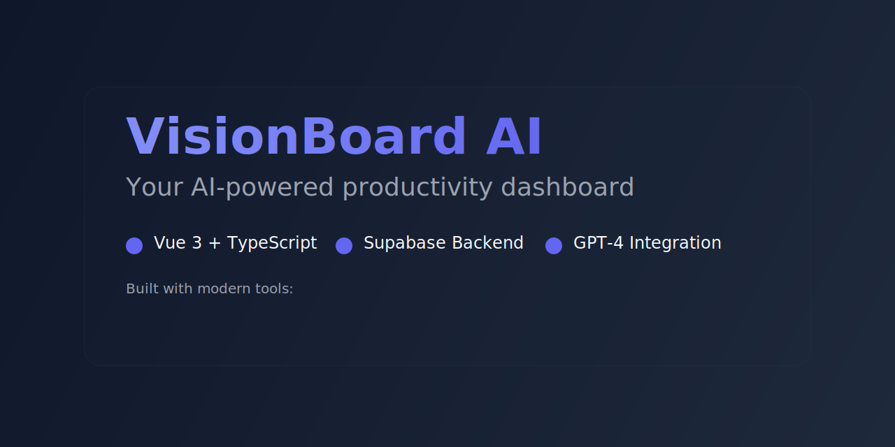

# VisionBoard AI Media Kit

This directory contains media assets for the VisionBoard AI GitHub repository.

## Repository Banner

## Feature Screenshots
### Dashboard Overview

- Main dashboard view with dark theme
- Real-time analytics visualization
- AI-powered insights panel

### Calendar Integration

- Google Calendar integration
- Task management interface
- Real-time updates

### AI Analysis

- GPT-4 powered insights
- Task suggestions
- Progress tracking

## Tech Stack Badges
Located in `badges/` directory:
-  Vue 3
-  TypeScript
-  Pinia
-  TailwindCSS
-  Supabase

## Brand Assets
### Logos
-  Dark theme
-  Light theme
-  Favicon

## Usage Guidelines
1. Always maintain aspect ratios
2. Don't modify the original colors
3. Keep the dark theme consistent
4. Preserve the glassmorphism effects
5. Use high-quality compression for images

## Color Palette
- Primary: `#4F46E5` (Indigo)
- Secondary: `#3B82F6` (Blue)
- Dark Background: `#0F172A`
- Text: `#F8FAFC`

## Typography
- Font Family: Inter
- Weights: 400 (regular), 500 (medium), 600 (semibold), 700 (bold)
- Use system font stack as fallback

## Demo Video
- [Watch the Demo](https://youtu.be/demo) - Coming soon
- Duration: 2-3 minutes
- Shows key features and functionality
- Includes voice-over explanation 